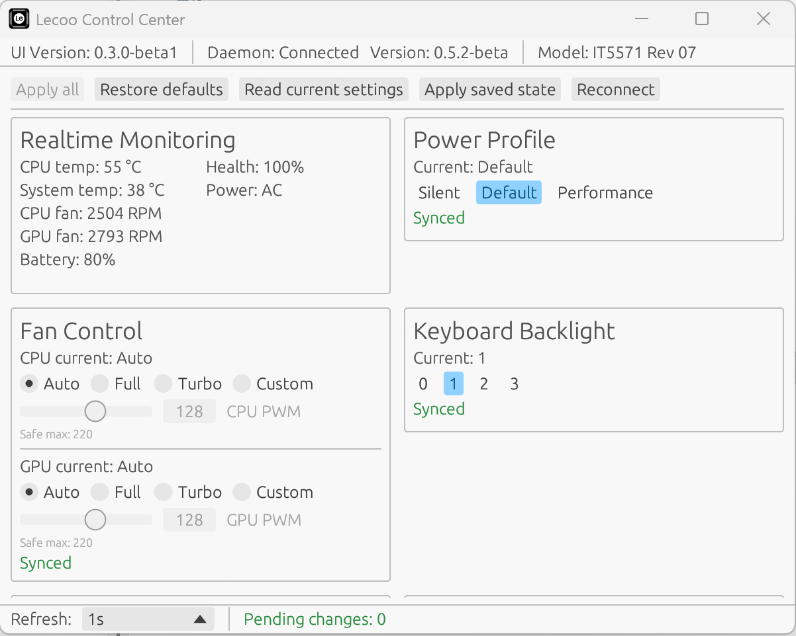

只加了ai生成的gui代码
cargo build -p lecoo --release

<div align="center">


<h3 align="center">
Lecoo Control Center is a reverse-engineered, low-level Embedded Controller (EC) daemon and command-line interface designed for laptops based on the Emdoor chassis (such as the Lecoo Pro 14 / Lecoo N155). It provides direct hardware-level control over cooling, power limits, and lighting, replacing the need for non-existent official software.
</h3>
</div>
<div align="center">

[](https://github.com/LaVashikk/Lecoo-Control-Center/releases/latest)
[](https://github.com/LaVashikk/Lecoo-Control-Center/blob/main/LICENSE)
[]()
[]()

🇷🇺 [Russian Readme here](README_RU.md)
CN [中文 Readme 在这](README_CN.md)

</div>

## ⚠️ Important Disclaimer

This software interacts directly with your system's hardware, specifically the Embedded Controller's (ITE IT5570/IT8987) HRAM window and low-level I/O ports. Incorrect configuration (such as setting custom fan curves to 0 RPM under heavy load) can result in overheating and irreversible hardware damage.

By using this software, you acknowledge these risks. The author is not responsible for any damage caused to your device. Use it at your own risk.

## Features

  * **System Monitoring:** Read CPU/System temperatures and fan speeds (RPM).
  * **Power Management:** Toggle between predefined EC power profiles (Silent, Default, Performance).
  * **Thermal Control:** Manage CPU and GPU fans independently (Auto, Full speed, or Custom PWM duty cycles).
  * **Battery Health (FlexiCharger):** Set custom battery charge limits to prolong battery lifespan (Full, High, Balanced, Lifespan, Desk mode).
  * **Lighting Control:** Adjust keyboard backlight brightness.
  * **Rear LED Ring Control:** Configure the rear power LED with static brightness or hardware-driven breathing animations.

## Supported Hardware

This software is primarily developed and tested on the Lecoo Pro 14 (Lecoo N155). Support for different revisions is tracked below:

| Model | Motherboard Revision | EC Chip | Status |
| :--- | :--- | :--- | :--- |
| Lecoo Pro 14 Amd (H255) | N155A | IT5571-07 | Confirmed Working |
| Lecoo Pro 14 Intel (Core Ultra 5) | N155D | IT5570-02 | Working, except the Power-LED control |
| Lecoo Pro 14 Intel (i5-13420H) | N155C | IT5570? | Probably Working |

**Note:** This software might theoretically work on other Emdoor-based laptops utilizing the ITE IT5570 or IT8987 Embedded Controllers, as the daemon includes basic HRAM offset auto-detection.

If you successfully run this on an unlisted hardware revision or a different Emdoor chassis, please open an issue or contact me to update the compatibility list!

## Installation

### ⚠️ Recommended: Use Pre-built Binaries

**Do NOT build from source unless you are a developer!** Download the latest pre-built release instead:

👉 **[Download Latest Release](https://github.com/LaVashikk/Lecoo-Control-Center/releases/latest)**

#### Windows Installation

1. Download the `lecoo-*-windows.zip` archive from the releases page.
2. Extract the archive to any folder.
3. Right-click on `install.bat` and select **"Run as Administrator"**.
4. Open a new terminal window and run `lecoo-ctrl help` to verify installation.

#### Linux Installation

1. Download the `lecoo-*-linux.tar.gz` archive from the releases page.
2. Extract the archive: `tar -xzf lecoo-*-linux.tar.gz`
3. Navigate to the extracted folder and run: `sudo ./install.sh`
4. Use the `lecoo-ctrl` command to interact with the daemon.

## Known Issues

* **Windows 11 Daemon Auto-start:** The background daemon currently fails to start automatically on Windows 11. The root cause is still under investigation.
* **FlexiCharger Reset on Power Loss:** If the laptop is powered off and unplugged from the wall for more than 5 minutes, the Embedded Controller (EC) clears its memory and resets the charge limits. If you plug the laptop in *before* booting up, the battery will charge to 100%. However, once the system boots and the daemon initializes, the battery will naturally discharge back down to your configured limit and resume normal behavior.
* **Charge Indicator in Custom LED Mode:** When the rear LED ring is set to `custom` mode, the standard battery charge indicator stops functioning.
* **LED Ring Stays On After Hard Shutdown:** If you perform a hard power-off (holding the power button) while the rear LED ring is in `custom` mode, the ring will remain lit. **Workaround:** Turn the laptop on and shut it down normally.
* **Conflicts with Official Software:** Using the `power` command to adjust TDP profiles may conflict with the manufacturer's official software (`PowerModeUtility`). It is highly recommended to use only one of these tools at a time.
* **Anti-cheat Software (Windows):** Some anti-cheat systems (such as FaceIT) may terminate the daemon process. This occurs because the daemon utilizes the official manufacturer driver to access the Embedded Controller.
* **Secure Boot & Kernel Lockdown (Linux):** On distributions with Secure Boot enabled (e.g., Fedora), the daemon currently cannot access low-level I/O ports (`/dev/port`), resulting in a "Lockdown" error. This limitation will be addressed in future updates.

## Usage (CLI)

The daemon runs in the background. You interact with it using the `lecoo-ctrl` command-line tool.


Here are the primary commands for `lecoo-ctrl`:

### System Information & Monitoring

  * `lecoo-ctrl help` - Display available commands and their usage.
  * `lecoo-ctrl info` - Retrieve basic EC information and daemon version.
  * `lecoo-ctrl temps` - Display current CPU and System temperatures.
  * `lecoo-ctrl fans` - Display current CPU and GPU fan speeds in RPM.

### Power & Battery Settings

  * `lecoo-ctrl power <silent|default|perf>` - Apply a specific power/TDP profile.
      * *Example:* `lecoo-ctrl power perf`
  * `lecoo-ctrl charge <full|high|balanced|lifespan|desk>` - Set battery charging thresholds (FlexiCharger).
      * *Example:* `lecoo-ctrl charge desk` (Limits charging to 40-50% for permanent AC usage).
      * Run `lecoo-ctrl charge` without arguments to view the current limit and battery capacity.

### Thermal Control

  * `lecoo-ctrl fan <cpu|gpu> <auto|full|custom> [value]` - Control fan behavior.
      * *Example (Automatic):* `lecoo-ctrl fan cpu auto`
      * *Example (Maximum Speed):* `lecoo-ctrl fan gpu full`
      * *Example (Custom PWM):* `lecoo-ctrl fan cpu custom 150` (Sets custom duty cycle).

### Lighting Control

  * `lecoo-ctrl kbd <0|1|2|3>` - Set keyboard backlight level (0 is off, 3 is maximum).
  * `lecoo-ctrl led <auto|custom>` - Control the rear LED ring.
      * *Example:* `lecoo-ctrl led custom 50`

## GUI

A Graphical User Interface (GUI) is currently in development and will be available in a future release.

## Telemetry & Data Collection

To help improve the software - specifically to refine the HRAM auto-detection logic across different motherboard revisions and catch unexpected daemon crashes - this project includes an **optional, fully anonymous telemetry system**.

**What is collected:**

  * Microcontroller data ONLY (EC chip version, HRAM memory offset).
  * CPU Name.1
  * Basic operational state (temperatures, fan RPM, active power profile).
  * Crash logs (Panic traces) if the daemon fails.

**What is NOT collected:**

  * Absolutely NO Operating System data, usernames, IP addresses, MAC addresses, or personal information.

Telemetry is enabled by default to support the project's growth. If you prefer to opt out, you can disable it at any time with the following command:

```bash
lecoo-ctrl daemon telemetry disable
```

## Building from Source (For Developers)

Ensure you have the Rust toolchain installed.

Clone the repository:

```bash
git clone https://github.com/LaVashikk/Lecoo-Control-Center.git
cd Lecoo-Control-Center
```

You can build the project using standard Cargo commands, or use the predefined aliases located in `.cargo/config.toml`:

**Windows:**

```bash
cargo build-win       # Builds the daemon
cargo build-ctrl-win  # Builds the CLI client
```

**Linux:**

```bash
cargo build-linux       # Builds the daemon
cargo build-ctrl-linux  # Builds the CLI client
```

## License & Support

This project is open-source and licensed under the MIT License. See the [LICENSE](LICENSE) file for more details.

If you find this tool useful and want to support its continued development, consider buying me a coffee (or a beer, who knows, lol)!

* **International:** [Donate via Lava.top](https://app.lava.top/lavashik?tabId=donate)
* **Russia:** [Donate via CloudTips](https://pay.cloudtips.ru/p/7e960f26)
* **China:** [Alipay](branding/alipay.jpg)
* **Cryptocurrency:**
  * **SOL (Solana):** `CvbAT3VduADYyGRBZDq5CD3kLYcYYjYjFzgWFftsbgAB`
  * **ETH (ERC-20):** `0x44B03F26B4dc7b8AcBBCFc456e4181872386a8D8`
  * **BTC (Native Segwit):** `bc1q3sej9r9v9syamjanq7mg6a7002pc4m6d6qnv6k`
